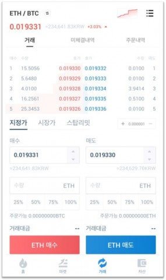
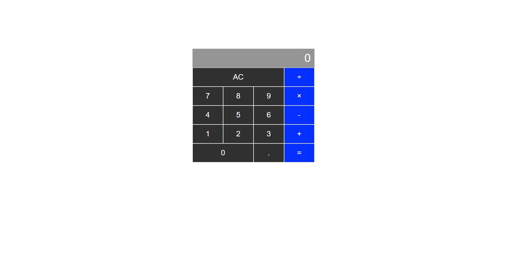
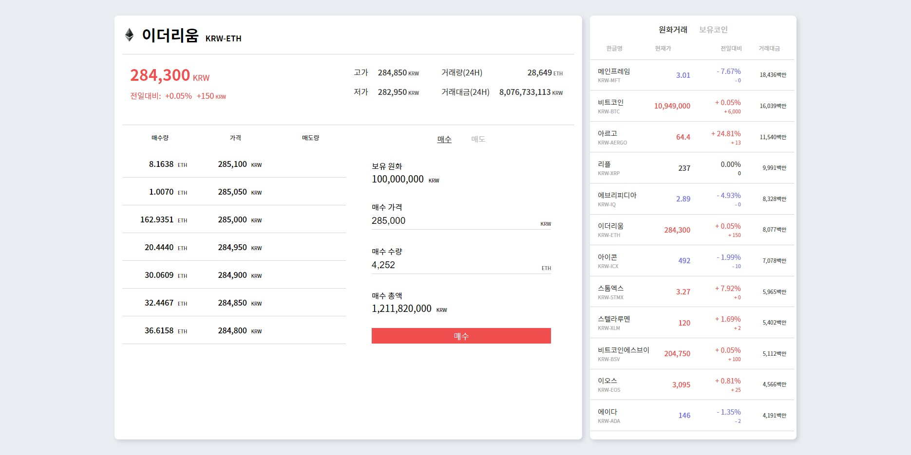
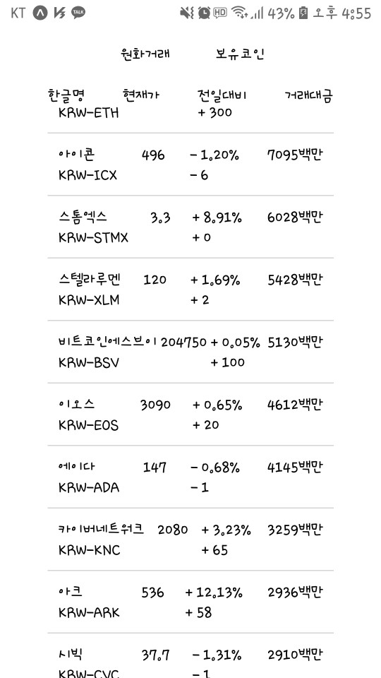

__소프트웨어 고등학교 학생들을 위한 리액트-네이티브로 가상화폐 거래소 어플리케이션 만들기__

# 강의 목차

## 1일차

저희가 사용할 React와 ReactNative의 개념에 대해 얕게 알아보고, 개발환경 설정을 합니다.

###  [1. 소개](https://github.com/nufyn/softwareschool-react_native/blob/master/first_introduce.md)

- 수업 소개
- 안드로이드 소개
- 리액트 / 리액트 네이티브 소개

### [2. 개발환경 세팅](https://github.com/nufyn/softwareschool-react_native/blob/master/second_setting.md)

- 기본 환경 세팅(nodejs, React, React-native, expo)
- 리액트 네이티브환경 세팅, 디바이스 설정
- 모바일 디바이스 실행 테스트

### [3. 어플리케이션 초기 실습](https://github.com/nufyn/softwareschool-react_native/blob/master/third_practice.md)

- 모바일 디바이스에서 구동
- React 문법 맛보기(실행 환경 테스트)
- 간단한 예제 학습 / 개발(html, css, js, React)

### 4 - 1. 어플리케이션 구상

- 레퍼런스 분석
- UI/UX 구상
- 콤포넌트 분리
- data flow 설계

***

## 2일차

저희가 만들 프로젝트의 개념도와 설계도를 구상합니다. 이 과정은 실무 전체에서 50%이상을 차지하는 중요한 작업입니다.

### 4 - 2. 어플리케이션 구상

- 레퍼런스 분석
- UI/UX 구상
- 콤포넌트 분리
- data flow 설계
  - context API

***

### 5. javascripts 기본 교육

기본 자바스크립트 언어에 대한 교육을 합니다. 깊이 있는 정보는 구글에서 검색해보며 직접 실습하는 것을 권장합니다. 저희는 React와 연관있는 것만(데이터타입, 연산자, 제어문, 배열, 함수, 객체, 클래스) 다루도록 합니다.

### [5 - 1장. 자바스크립트](https://github.com/nufyn/softwareschool-react_native/blob/master/js/first_javascripts.md)

- 소개
- 개요
- 기초
- 문법
- 적용

### [5 - 2장. 변수 / 데이터](https://github.com/nufyn/softwareschool-react_native/blob/master/js/second_variable.md)

- 자바스크립트 변수 데이터 / 범위
- 자바스크립트 데이터 타입
  - 숫자(number)
  - 문자열(string)
  - 불리언(boolean)
- 자바스크립트 타입 변환

### [5 - 3장. 연산자](https://github.com/nufyn/softwareschool-react_native/blob/master/js/third_operator.md)

- 산술 연산자
- 증감 연산자
- 대입 연산자
- 비교 연산자
- 논리 연산자

### [5 - 4장. 제어문](https://github.com/nufyn/softwareschool-react_native/blob/master/js/fourth_CS.md)

- 자바스크립트 제어문
- 조건문
- 반복문
- 기타 제어문

### [5 - 5장. 배열](https://github.com/nufyn/softwareschool-react_native/blob/master/js/fifth_array.md)

- 배열 개념
- 배열 실습
- 배열 활용

### [5 - 6장. 함수](https://github.com/nufyn/softwareschool-react_native/blob/master/js/sixth_function.md)

- 함수 개념
- 함수 범위
  - 함수와 변수
- 함수 실습
- 함수 활용

### [5 - 7장. 객체](https://github.com/nufyn/softwareschool-react_native/blob/master/js/seventh_object.md)

- 객체 개념
- 객체 이해
- 객체 프로퍼티 / 메서드
  - 객체 실습
- 객체 활용

### [5 - 8장. 프로젝트 실행](https://github.com/nufyn/softwareschool-react_native/blob/master/js/caculator/)

- 자바스크립트 활용 프로젝트 - 계산기 만들기

 

#### [부록. 자주쓰는 내장함수](https://github.com/nufyn/softwareschool-react_native/blob/master/js/innerFunc.md)

***

## 3일차

### 6. react 기본 교육

#### 요약 
- React(jsx)와 js의 차이 교육
- React전용 문법 교육(components / lib import / props)
- 리액트 HOC(Higher-Order Component) / 리액트 Currying 기법 교육 / 리액트 Context 기법 교육
- 리액트 Redux 간단 교육 -> React hooks
> "The One With Hook"이라고도 불리는 React버전 16.8의 출시와 함께, 오랫동안 기다려 온 hooks 패턴이 소개되었습니다. 이 패턴을 사용하면 state, lifecycles 및 class를 사용하지 않고도 다른 모든 대체 기능을 사용할 수 있습니다."
- 리액트 Hooks 기법 교육(state, effect)
- axios를 활용한 외부 API 연결하기

### [6 - 1장. JSX소개](https://github.com/nufyn/softwareschool-react_native/blob/master/react/first_jsx.md)

- 소개
  - jsx없이 React써보기
- element

### [6 - 2장. components / props](https://github.com/nufyn/softwareschool-react_native/blob/master/react/second_components.md)

- 클래스 컴포넌트
- 함수형 컴포넌트

### [6 - 3장. state / lifecycle](https://github.com/nufyn/softwareschool-react_native/blob/master/react/third_lifecycle.md)

- state
- lifecycle
- 제어 컴포넌트
  - input
  - input:file
  - textarea
  - select

### [6 - 4장. event / Conditional Rendering / Lists and key](https://github.com/nufyn/softwareschool-react_native/blob/master/react/fourth_event.md)

- event
- 조건부 렌더링
- map() / key

### [6 - 5장. React hooks](https://github.com/nufyn/softwareschool-react_native/blob/master/react/fifth_hooks.md)

- hooks 소개
  - hooks 개요
  - hooks 특징
- state hooks
- effect hooks

 

### [부록. React 관련 용어](https://github.com/nufyn/softwareschool-react_native/blob/master/react/Supplement.md)

***

## 4일차

React와 React-Native 의 차이에 대해서 알아보고, axios를 통해 RestAPI 데이터를 받아 활용해보자

### 7장. React와 React-native

## [7 - 1. React VS React-native](https://github.com/nufyn/softwareschool-react_native/blob/master/RN/first_difference.md)

- feature
- 쓰임
- design

## [7 - 2. view](https://github.com/nufyn/softwareschool-react_native/blob/master/RN/second_RN.md)

- React-native styling
- CoreComponents

##  [7 - 3. axios](https://github.com/nufyn/softwareschool-react_native/blob/master/RN/third_axios.md)

- axios를 통한 restAPI 데이터 활용

***

## 5일차

### 8장. 실습

### [7 - 1장. React 실습 프로젝트](https://github.com/nufyn/softwareschool-react_native/blob/master/react/exchange/)

- 거래소 UI / UX 제작
- axios를 이용하여 거래소 데이터 rest api 불러오기(upbit)
- 거래소 기능 개발

### [7 - 2장. React-native 실습 프로젝트](https://github.com/nufyn/softwareschool-react_native/blob/master/react/exchange/)

- 거래소 UI / UX 제작
- axios를 이용하여 거래소 데이터 rest api 불러오기(upbit)

***
