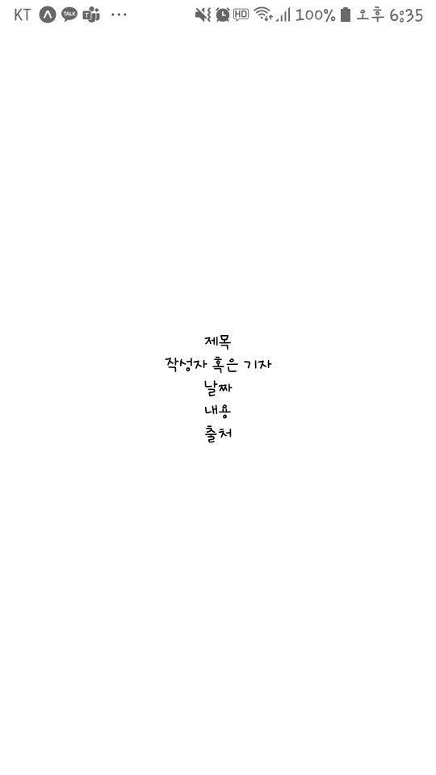
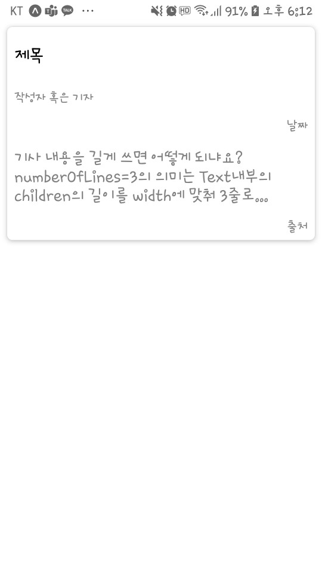
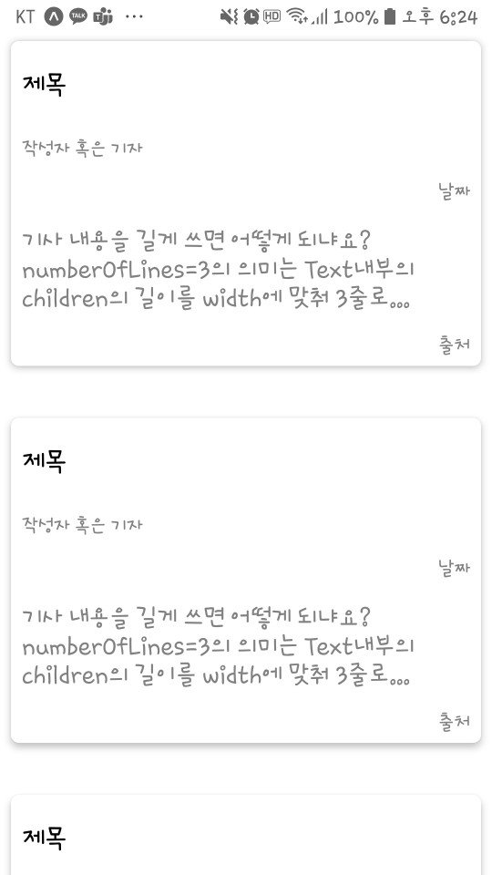

# ReactNative 

## 1 - 1) CoreComponents

### View

View는 ReactNative의 코어컴포넌트중 하나로, html에서 div만큼이나 자주 쓰이는 녀석입니다. 형제로는 ScrollView가 있으며, 둘의 쓰임은 둘 다 div같은 요소를 감싸는 존재지만, ScrollView의 경우 이름에서도 알 수 있듯이 스크롤이 가능한 View입니다. 

### Text

Text 컴포넌트는 html의 p를 대신하는 컴포넌트입니다. 주로 하는 역할은 텍스트의 표시, 스타일 및 중첩 문자열과 터치 이벤트 처리등 입니다.

#### 표

|default| android|ios|web|설명|
|:---:|:---:|:---:|:---:|:---:|
|`<View>`|`<ViewGroup>`|`<UIView>`|`<div>`|flexbox, 스타일, 터치 처리 및 접근성 제어 기능이 있는 레이아웃을 지원하는 컨테이너|
|`<ScrollView>`|`<ViewGroup>`|`<UIView>`|`<div>`|여러 구성 요소 및 보기를 포함할 수 있는 일반 스크롤 컨테이너|
|`<Text>`|`<ViewGroup>`|`<UIView>`|`<div>`|텍스트의 표시, 스타일 및 중첩 문자열과 터치 이벤트 처리|
|`<TextInput>`|`<ViewGroup>`|`<UIView>`|`<div>`|사용자가 텍스트를 입력할 수 있습니다.|
|`<Image>`|`<ViewGroup>`|`<UIView>`|`<div>`|다양한 유형의 이미지를 표시합니다.|

***

## 2 - 2) View 

실습겸 프로젝트 뷰를 만들어 보도록 하겠습니다. 코어컴포넌트만 이용해 간단하게 만들어 보겠습니다.

```JAVASCRIPT
import React from "react";
import { View, Text, StyleSheet } from "react-native";

export default function App() {
  return (
    <View style={styles.container}>
      <Text>제목</Text>
      <Text>작성자 혹은 기자</Text>
      <Text>날짜</Text>
      <Text>
        내용
            </Text>
      <Text>출처</Text>
    </View>
  );
}

const styles = StyleSheet.create({
  container: {
    flex: 1,
    backgroundColor: '#fff',
    alignItems: 'center',
    justifyContent: 'center',
  },
});
```



자, 이제 스타일을 입혀봅시다. style은 Styles라고 하는 react-native 자체 API를 사용해서 스타일만을 가진 컴포넌트로 작성해야 합니다.

#### 스타일만을 가진 컴포넌트
```JAVASCRIPT
const styles = StyleSheet.create({
  cardWrap: {
    ...Platform.select({
      ios: {// ios 그림자
        shadowColor: "#000",
        shadowOffset: { width: 0.2, height: 0.5 },
        shadowOpacity: 0.5,
        shadowRadius: 1,
      },
      android: {//안드로이드 그림자
        elevation: 4
      },
    }),
    backgroundColor: "white",
    margin: 8,
    marginTop: 30,
    borderRadius: 6,
  },
  textWrap: {
    display: "flex",
    flexDirection: "row",
    flexWrap: "nowrap",
    justifyContent: "space-between",
    marginHorizontal: 8,
    marginVertical: 6,
  },
  title: {
    marginHorizontal: 8,
    marginVertical: 18,
    color: "black",
    fontSize: 20,
    fontWeight: "800"
  },
  description: {
    marginHorizontal: 8,
    marginVertical: 8,
    color: "gray",
    fontSize: 18
  },
  image: {
    height: 160,
    marginHorizontal: 8,
    marginVertical: 6
  },
  author: {
    marginHorizontal: 8,
    marginVertical: 6,
    fontSize: 14,
    color: "gray"
  },
  date: {
    marginHorizontal: 8,
    marginVertical: 6,
    textAlign: "right",
    fontSize: 14,
    color: "gray"
  },
  source: {
    marginHorizontal: 8,
    marginVertical: 6,
    textAlign: "right",
    fontSize: 14,
    color: "gray"
  }
```

자, 실습을 해봅시다. 위의 스타일링 예제를 따라가셔도 되고, 새롭게 만들어 보셔도 됩니다.

```JAVASCRIPT
import { StatusBar } from 'expo-status-bar';
import React from 'react';
import { StyleSheet, Text, View } from 'react-native';

export default function App() {
  return (
    <View style={styles.cardWrap}>
      <Text style={styles.title}>제목</Text>
      <Text style={styles.author}>작성자 혹은 기자</Text>
      <Text style={styles.date}>날짜</Text>
      <Text style={styles.description} numberOfLines={3}>
        기사 내용을 길게 쓰면 어떻게 되나요? numberOfLines={3}의 의미는 Text내부의 children의 길이를 width에 맞춰 3줄로 잘라내는 역할을 합니다.
            </Text>
      <Text style={styles.source}>출처</Text>
    </View>
  );
}

const styles = StyleSheet.create({
  cardWrap: {
    ...Platform.select({
      ios: {// ios 그림자
        shadowColor: "#000",
        shadowOffset: { width: 0.2, height: 0.5 },
        shadowOpacity: 0.5,
        shadowRadius: 1,
      },
      android: {//안드로이드 그림자
        elevation: 4
      },
    }),
    backgroundColor: "white",
    margin: 8,
    marginTop: 30,
    borderRadius: 6,
  },
  textWrap: {
    display: "flex",
    flexDirection: "row",
    flexWrap: "nowrap",
    justifyContent: "space-between",
    marginHorizontal: 8,
    marginVertical: 6,
  },
  title: {
    marginHorizontal: 8,
    marginVertical: 18,
    color: "black",
    fontSize: 20,
    fontWeight: "800"
  },
  description: {
    marginHorizontal: 8,
    marginVertical: 8,
    color: "gray",
    fontSize: 18
  },
  image: {
    height: 160,
    marginHorizontal: 8,
    marginVertical: 6
  },
  author: {
    marginHorizontal: 8,
    marginVertical: 6,
    fontSize: 14,
    color: "gray"
  },
  date: {
    marginHorizontal: 8,
    marginVertical: 6,
    textAlign: "right",
    fontSize: 14,
    color: "gray"
  },
  source: {
    marginHorizontal: 8,
    marginVertical: 6,
    textAlign: "right",
    fontSize: 14,
    color: "gray"
  }
});
```



이렇게 스타일이 들어가 예쁜 카드가 만들어 졌습니다.

저 카드를 재사용하기 위해서는 컴포넌트로 추출해서 쓰면 편하겠죠?

```JAVASCRIPT
import { StatusBar } from 'expo-status-bar';
import React from 'react';
import { StyleSheet, Text, View, ScrollView } from 'react-native';

// 컴포넌트를 추출해서 써보세요.

export default function App() {
  return (
    <ScrollView> {/*ScrollView는 모바일 디바이스에서 overflow된 데이터에 맞게 scroll이 가능하게 해줍니다.*/}
      <NewsCard />
      <NewsCard />
      <NewsCard />
      <NewsCard />
      <NewsCard />
    </ScrollView>
  );
}

const styles = StyleSheet.create({  
      ...
});

```

<br/>

#### 이렇게 나오면 성공입니다!


View에 대한 이해가 조금 되시나요? 다음 장에서도 이어서 데이터를 넣는 방법과 좀 더 이뻐진 styling자료로 저희 프로젝트를 디벨롭해보겠습니다.