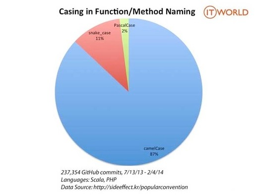

# 1장. javascripts

## 1 - 1) 소개

### 자바스크립트는 다음과 같은 특징을 가집니다

- javascript는 객체 기반의 언어입니다. 하지만 클래스개념은 없습니다.
- javascript는 HTML에 연산 제어 등 프로그래밍적인 요소를 추가하고 클라이언트의 자원을 활용할 수 있게 합니다.
- javascript는 인터프리터 언어로서 클라이언트의 웹 브라우저에 의해 해석되고 실행됩니다.
- javascript는 HTML문서 내에 기술되고 HTML 문서와 함께 수행됩니다.
- 자바스크립트는 주로 웹 브라우저에서 사용되나, Node.js와 같은 프레임워크를 사용하면 서버 측 프로그래밍에서도 사용할 수 있습니다.
- 언어 규격은 자바의 부분 집합(subset)으로 되어 있습니다만은 자바와는 다른 언어입니다.

>인터프리터 언어는 사용자가 실행할 수 있는 실행 파일(.exe)로 만드는 과정을 거치지 않고, 소스 코드를 바로 실행할 수 있는 언어를 의미합니다.

<br/>

### 자바스크립트와 자바의 비교

| javascripts | java |
|:---:|:---:|
| 객체지향, 객체의 형 간에 차이 없음. 프로토타입 매커니즘을 통한 상속, 그리고 속성과 메서드는 어떤 객체든 동적으로 추가될 수 있음 | 클래스기반, 객체는 크래스 계층구조를 통한 모든 상속과 함께 클래스와 인스턴스로 나뉨. 클래스와 인스턴스는 동적으로 추가된 속성이나 메서드를 가질 수 없음 |
| 변수 자료형이 선언되지 않음. | 변수 자료형은 반드시 선언되어야 함. |
| 하드디스크에 자동으로 작성 불가. | 하드디스크에 자동으로 작성 가능. |

<br/>

### 자바스크립트가 하는 일

- HTML 페이지 변경 및 HTML 엘리먼트와 콘텐츠의 추가나 제거
- CSS 및 HTML 엘리먼트의 스타일 변경
- 사용자와의 상호작용, 폼의 유효성 검증
- 마우스와 키보드 이벤트에 대한 스크립트 실행
- 웹 브라우저 제어, 쿠키 등의 설정과 조회
- AJAX 기술을 이용한 웹 서버와의 통신
- 동적인 효과 이미지 롤오버 상태표시줄에 문자열표시 등등
- 웹사이트의 기능적인 면 쿠키처리, 새로운 Window열기 등등

<br/>

## 1 - 2) javascripts 개요

#### 순수 자바스크립트의 함수 정의

```JAVASCRIPT
function nufynComeFunny() {
    document.getElementById("text").innerHTML = "Hello world!";
}

nufynComeFunny()
```

#### html내에서 자바스크립트의 모습

```html
<script>
    document.getElementById("text").innerHTML = "Hello world!";
</script>
```

<br/>

## 1 - 3) javascripts 문법

javascripts은 세미콜론으로 끝나는 것을 기본으로, 내장되어 있는 예약어(키워드)들과 식별자를 이용해서 프로그래밍하게 됩니다.

<br/>

#### 자주쓰는 기본 예약어
| 값 | 의미 | 기본값 |
|---|:---:|:---:|
| `var` | 변수 선언시, 재할당, 재선언 모두 가능 | 변수 정의 |
| `let` | es6에 추가된 변수 선언시, 변수 재선언은 불가능하지만, 재할당은 가능 | 변수 정의 |
| `const` | es6에 추가된 변수 선언시, 상수처럼 재선언, 재할당 모두 불가 | 변수 정의 |
| `class` | es2015에 추가된 클래스의 정의를 위해 예약된 키워드 | 클래스 정의 |
| `function` | 함수의 정의를 위해 예약된 키워드 | 함수 정의 |
| `this` | 해당 키워드가 사용된 자바스크립트 코드 영역을 포함하고 있는 객체 |  |
| `if`, `for`... | 제어문을 위해 예약된 키워드 | 제어문 |
| `+`, `-`, `++`... | 사칙연산과 수치계산을 위한 키워드 | 산술연산자 |
| `=`, `+=`... | 지정된 변수에 특정값을 대입하는 키워드 | 대입연산자 |
| `==`, `!=`, `>`... | 좌우의 값을 비교하는 키워드 | 비교연산자 |
| `typeof` | 피연산자의 타입을 반환해주는 연산자 |  |

<br/>

_*그 밖에_

- string의 사용등에서 '' 보단 ""의 사용을 권장하며, 
- 주석은 "//"와 "/** */"로 사용가능하지만, "/**/"를 권장합니다.
- 식별자의 네이밍은 세가지 형태 __lowerCamelCase__ , __UpperCamelCase(=PascalCase)__ 와 __snake_case(=underscore_case)__ 가 있습니다. 이는 자바스크립트의 아래의 규칙때문에 그렇습니다.



>자바스크립트에서 식별자는 숫자와 식별자의 구별을 빠르게 할 수 있도록 숫자로는 시작할 수 없습니다. 
자바스크립트에서 하이픈(-)은 뺄셈을 위해 예약된 키워드이므로, 식별자를 작성할 때는 사용할 수 없습니다.


<br/>

# 1 - 4) javascripts 적용

#### html에 텍스트 출력하기
```html
<!DOCTYPE html>
<html lang="ko">
    <head>
        <meta charset="UTF-8">
        <title>Nufyn</title>
        <script>
            document.write("<p>script는 html의 head태그안에 삽입할 수 있습니다.</p>")
        </script>
    </head>
    <body>
        <script>
            document.write("<h2>(권장!)혹은 body 닫는 태그의 바로 위에 삽입할 수도 있습니다.</h2>")
        </script>
    </body>
        <script>
            document.write("<h3>(권장하지 않음!)body태그 밖에 삽입해도 기능은 동작하지만, 권장하지 않습니다.</h3>")
        </script>
</html>
```

#### 함수 정의 후, html에서 출력하기

```html
<!DOCTYPE html>
<html lang="ko">
    <head>
        <meta charset="UTF-8">
        <title>Nufyn</title>
        <script>
            function printDate() {
                document.getElementById("text").innerHTML = "지금은!";
                document.getElementById("date").innerHTML = Date();
            }
        </script>
    </head>
    <body>
        <button onclick="printDate()">시간알림 버튼</button>
        <h1 id="text">Hello world</h1>
        <p id="date"></p>
        <h2>입니다!</h2>
    </body>
</html>
```

***
