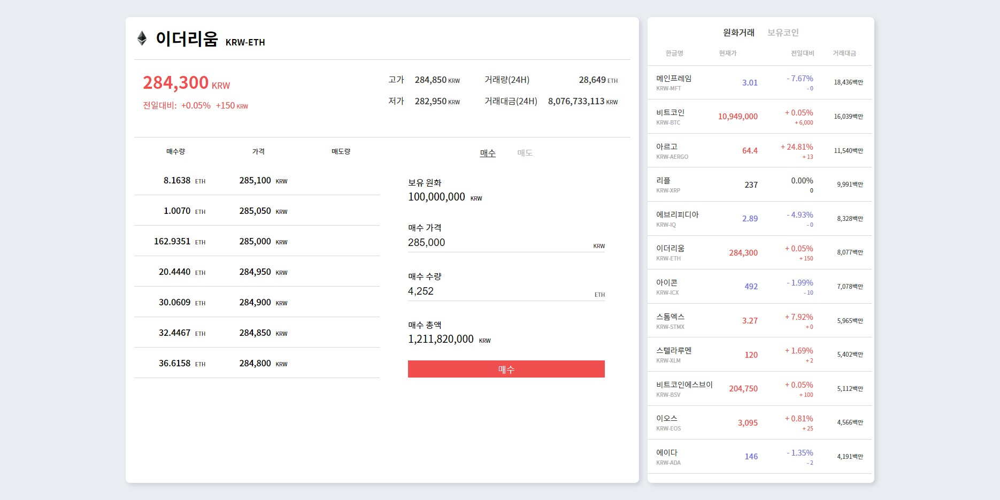

# 소프트웨어 고등학교 학생들을 위한 Reactjs 기초 강의 자료

## 목차

 

### 0장. 개발환경 세팅

1. nodejs
2. react, react-native
3. expo-cli

 

### 1장. JSX소개

1. 소개
    - jsx없이 react써보기
2. element

 

### 2장. components / props

1. 클래스 컴포넌트
2. 함수형 컴포넌트

 

### 3장. state / lifecycle 

1. state
2. lifecycle
3. 제어 컴포넌트
    - input
    - input:file
    - textarea
    - select

 

### 4장. event / Conditional Rendering / Lists and key

1. event
2. 조건부 렌더링
3. map() / key

 

### 5장. react hooks
1. hooks 소개
    - hooks 개요
    - hooks 특징
2. state hooks
3. effect hooks

### 6장. 실습 어플리케이션 구상(레퍼런스 참조)

 

### 부록. react 관련 용어

***
