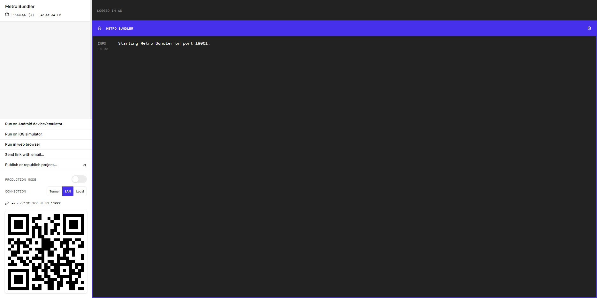
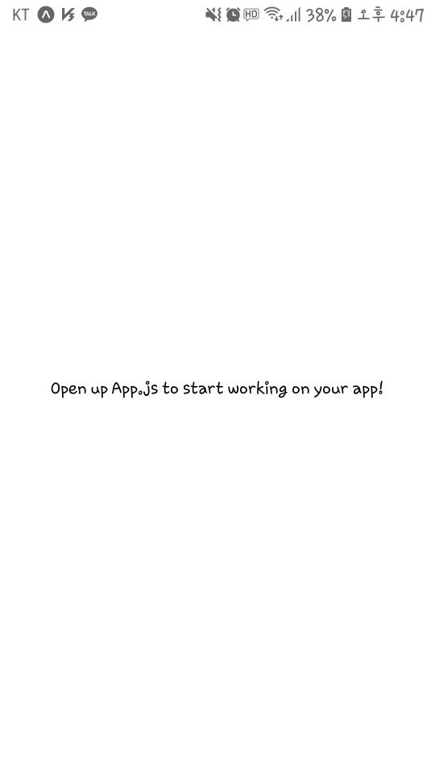

# 환경설정

개발 환경을 세팅하면서 웹의 기본적인 구동원리를 학습할 수 있습니다.

## 2 - 1) 개발환경 세팅

일단, 5일간의 대장정에 앞서 저희에게는 준비물이 필요합니다. 컴퓨터와 코드에디터는 기본이구요. 각자 하나씩은 들고 있을 모바일기기와 열정입니다. 자, 그럼 시작해보겠습니다.

### nodejs

코드에디터를 켜주시고, 저희가 가장 먼저 해야할 일은 바로 Nodejs를 설치 하는 것입니다. 왜냐하면 React가 Node에 뿌리를 두고 있기 때문입니다. 

>https://nodejs.org/ko/

로 접속해보도록 하겠습니다. 

접속하시면 바로 중앙에 다운로드를 유도하는 초록 버튼이 두개 보일 겁니다. 

1. LTS(Long Term Support)
2. Recently

저희는 LTS버전을 다운로드 받아 사용할겁니다. LTS는 장기 지원 버전인데, 말 그대로 큰 업데이트없이 안정적으로 길게 사용할 수 있는 버전입니다. 최신버전을 다운받아 사용하면, 프로젝트를 할 때마다 혹은 프로젝트 진행중에 충돌이 일어 날 수 있으므로, 안정적인 LTS버전을 쓰는 것을 권장합니다. 

그 밖에, Nodejs는 js개발자들을 한데 모아준 고마운 녀석입니다. 공식 사이트에서는 다양한 issue와 문서를 다루고 있으니, 관심있으신 분들은 자주 들러서 확인해보시는 걸 추천해 드립니다.

_*Node.js는 자바스크립트 런타임일 뿐, 결코 UI 혹은 HTML을 표현하지는 않습니다._

설치가 끝나셨다면,각자 컴퓨터에 있는 터미널 콘솔을 열어서 
```
$ node --version 
```

```
$ npm --version
```

를 입력해 보세요. 버전이 출력된다면, 성공적으로 설치가 된 것입니다.


_*참고로 npm은 Node 패키지 매니저입니다. 말그대로 Nodejs의 모듈을 관리해주는 녀석이죠._

### React

Nodejs의 설치가 완료되었다면, React의 설치의 매우 쉽습니다. 

```
$ npm install react
```

이렇게 입력하시면 되는데요. 저희는 리액트로 큰 프로젝트를 하지 않을 것이기 때문에 연습용 혹은 테스트용으로 사용하기 좋은 모듈을 하나 소개해 드리겠습니다.

```
$ npm install -g create-react-app
```

이렇게 입력하시면 CRA라고 하는 React의 boilerplate가 자동으로 설치가 됩니다. 이제 저희는 페이스북이 미리 만들어 놓은 도화지를 단지 가져와서 입맛대로 프로젝트를 진행할 수 있습니다.

```
$ create-react-app my-app   
```

설치가 다 끝났다면 my-app이란 디렉토리가 생기고 그 안에 이것저것 들어간 React 초기 형태가 생성됩니다. React의 거의 모든것이 들어간 boilerplate라 무겁지만 쉽고 빠르게 React를 시작할 수 있게 만들어주고, scss등을 간단하게 세팅할 수 있게 도와주어 크지 않은 프로젝트에는 이 CRA가 많이 쓰입니다.

실행을 한번 시켜보겠습니다.

```
$ cd my-app

$ npm start
```


### ReactNative

ReactNative의 세팅도 마찬가지로 npm을 이용해서 진행하시면 되겠습니다. 

```
$ npm install react-native
```

하지만 React도 저렇게 훌륭한 보일러플레이트가 있는데, 더 까다로운 native에는 없을까요? 있습니다.

그렇다면, 이번에도 쉽고 빠르게 ReactNative를 세팅해 보겠습니다.

_*참고로 react-native는 두개의 파로 나뉩니다. react-native-cli를 사용하는 정통파와 지금 저희들이 실행할 expo-cli를 사용하는 실속파로 나뉩니다._

```
$ npm install -g expo-cli
```

그리고 나서

```
$ expo --version

$ expo init my-app
```

여기서 expo init을 하면 expo전용 보일러플레이트가 만들어 지는데, 초기설정을 해주어야 합니다. 다른 설정값은 각자 테스트해보시거나 구글링 해보시길 바랍니다. 저희는 아무것도 바꾸지 말고 그대로 엔터를 쳐서 default로 만들겠습니다.

1. blank 선택
2. my-app(혹은 프로젝트 네임)

설치가 다 되었으면, 실행을 시켜봅시다. 

```
$ cd my-app

$ expo start
```



웹이 열리면서 expo 터미널이 보이고, 좌측하단에 qr코드가 보일것 입니다. 이 qr코드로 모바일에 저희의 코드를 렌더링시킬 겁니다. 모두들 와이파이를 켜시고(컴퓨터와 모바일이 같은 와이파이를 사용해야 함.), 앱스토어에 들어가셔서 모바일에 expo를 설치하여 다운로드 받아주세요. expo를 실행시켜서 qr코드를 스캔하시면 뷰가 렌더링되어 보일 것입니다.




모바일에 화면이 잘 보이시나요? 이로써 여러분들은 5일간의 대장정을 시작할 수 있게 되었습니다. 자, 시작이 반이라는 말이 있듯이 개발도 개발환경세팅이 절반입니다. 축하드립니다.

_*안드로이드스튜디오 에뮬레이터를 이용한 방법은 궁금하신 분에 한해, 개인적으로 설치하여 사용해보세요._

***
