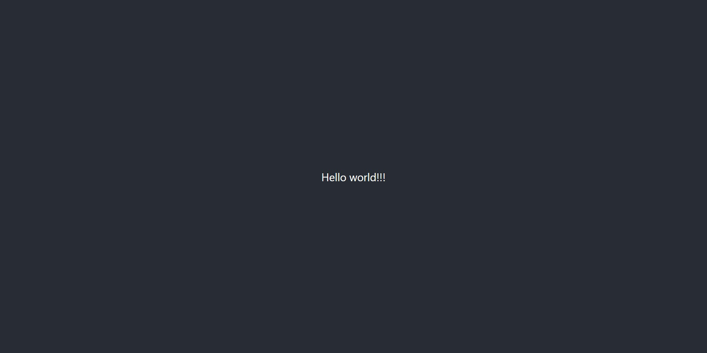

# 3장. 테스트

코드의 의미는 몰라도 됩니다. 적어도 지금은요. 실습환경이 제대로 잘 설정되었는지, 그리고 앞으로 죽 봐야할 코드에 대해 친숙해지는 시간입니다.

## 3 - 1) react

#### 초기화면


처음에 npm start해서 보았던 화면을 기억하시죠?

my-app/ 디렉토리안에 src/App.js를 보시면 header 태그가 있습니다. header태그 내부를 다 지워주시면 아무것도 없는 흰 바탕이 나옵니다.

```JAVASCRIPT
import React from 'react';
import logo from './logo.svg';
import './App.css';

function App() {
  return (
    <div className="App">
      <header className="App-header"> 
         {/** 여기 header태그 안을 다 지워주세요 */}
        <p>
          Edit <code>src/App.js</code> and save to reload.
        </p>
        <a
          className="App-link"
          href="https://reactjs.org"
          target="_blank"
          rel="noopener noreferrer"
        >
          Learn React
        </a>
      </header>
    </div>
  );
}

export default App;
```

그리고 나서 가장 기본적인 Hello world!!! 출력을 해봅시다.

```JAVASCRIPT
import React from 'react';
import logo from './logo.svg';
import './App.css';

function App() {
  return (
    <div className="App">
      <header className="App-header"> 
        Hello world!!!
      </header>
    </div>
  );
}

export default App;
```



이쁘네요!